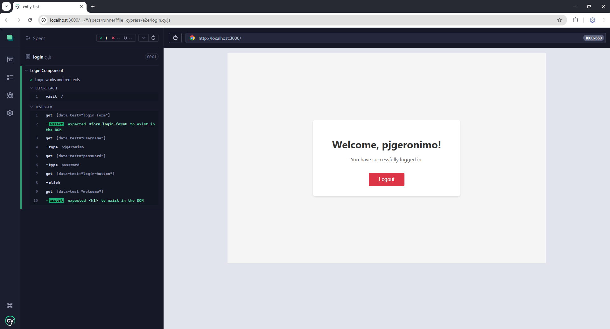

# zipBoard Junior Developer Challenge Write-up

Thank you for inviting me to complete this junior developer test challenge! My name is Paolo Jose Geronimo and below is a short write-up of how I fixed the bug and wrote a Cypress test to ensure the bug is fixed.

## Short explanation of the bug

The first thing I did after starting the development server was to try logging in. After confirming that the log in page does not redirect, I took a look at the code. I noticed that the form in LoginForm.js does nothing upon submit, so I added an onSubmit attribute to the form and wrote the handleSubmit function. App.js uses a "onLogin" prop which I called in the handleSubmit function.

To write the Cypress test, I started by visiting the baseURL which was preconfigured in cypress.config.js. I then added "data-test" attributes to each element I wanted to test. The steps in the test are as follows:

- Check if login form exists
- Type "pjgeronimo" into the username field
- Type "password" into the password field
- Click login
- Check if the welcome header exists

I also created a custom command that shortens getting the data-test element and reduces repetitive code.

Below is a screenshot of the completed and successful test:



## Example of AI tools used

One interesting problem I faced during creating the test was that while the page redirected manually, it didn't redirect during the Cypress test. I explained my problem to ChatGPT and pasted in only the code I wrote. Below is the prompt and snippet of the response that solved my problem:


# zipBoard Junior Position Test Project

This is a test repository for the zipBoard junior position application process. This project demonstrates a simple React application with a login form and Cypress testing setup.

## Important Note

This repository is for testing purposes only. Please fork this repository to your own account and do not modify this original repository. All your work should be done in your forked version.

## Required Technologies

To run this project locally, you need to have the following installed:

- Node.js (version 18 or higher)
- npm (comes with Node.js)
- Git

## Getting Started

1. Fork this repository to your own account
2. Clone your forked repository:
   ```bash
   git clone <your-forked-repo-url>
   ```
3. Install dependencies:
   ```bash
   npm install
   ```
4. Start the development server:
   ```bash
   npm start
   ```
   The application will be available at [http://localhost:3000](http://localhost:3000)

## Testing with Cypress

This project uses Cypress for end-to-end testing. To run the tests:

1. Make sure the development server is running (`npm start`)
2. In a new terminal, you can run Cypress in two ways:

   ### Open Cypress Test Runner (Interactive Mode)

   ```bash
   npm run cypress:open
   ```

   This will open the Cypress Test Runner UI where you can:

   - Choose your preferred browser
   - See all test files
   - Run tests interactively
   - Watch tests run in real-time

   ### Run Tests in Headless Mode

   ```bash
   npm run cypress:run
   ```

   This will run all tests in the terminal without opening the UI.

   ### Run Tests with Dev Server

   ```bash
   npm run test:e2e
   ```

   This command will:

   1. Start the development server
   2. Wait for it to be available
   3. Run all Cypress tests
   4. Shut down the server when done

## Project Structure

```
├── src/
│   ├── components/
│   │   ├── LoginForm.js
│   │   ├── LoginForm.css
│   │   ├── Welcome.js
│   │   └── Welcome.css
│   ├── App.js
│   └── App.css
├── cypress/
│   ├── e2e/
│   │   └── login.cy.js
│   └── support/
│       ├── commands.js
│       └── e2e.js
└── package.json
```

## Available Scripts

- `npm start` - Runs the app in development mode
- `npm test` - Runs the React testing suite
- `npm run build` - Builds the app for production
- `npm run cypress:open` - Opens Cypress Test Runner
- `npm run cypress:run` - Runs Cypress tests in headless mode
- `npm run test:e2e` - Runs Cypress tests with the dev server

## License

This project is for testing purposes only and is not licensed for public use.
